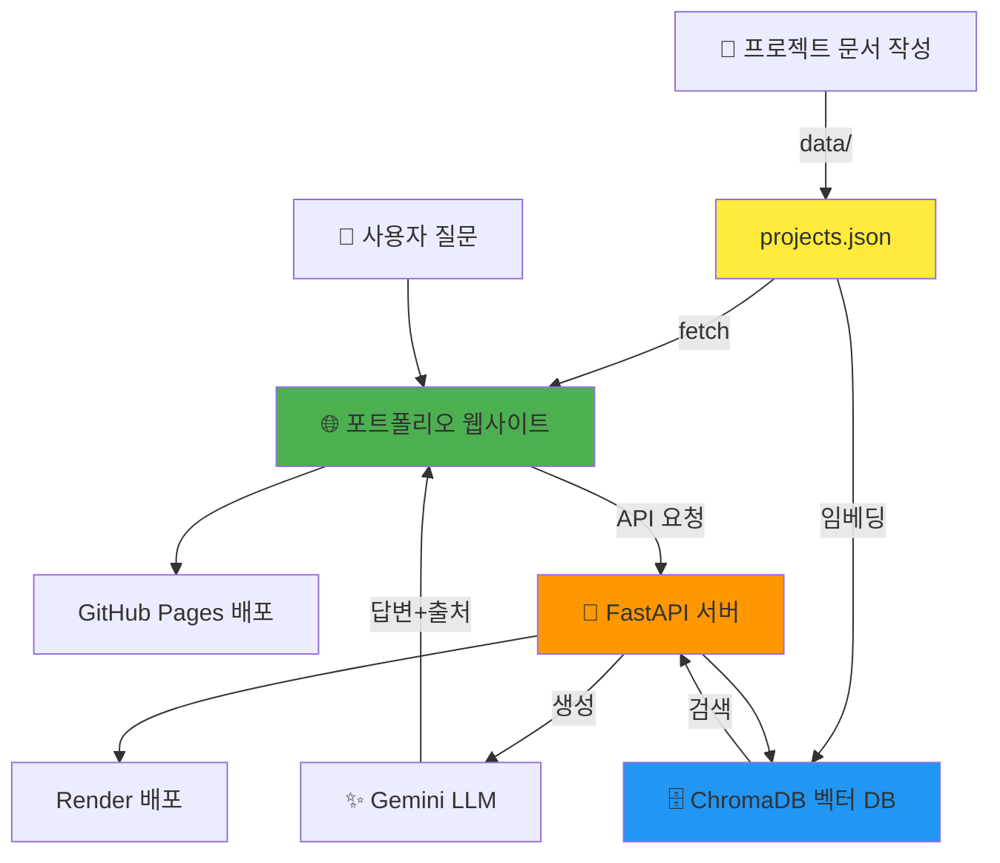

# 전체 개요 및 아키텍처

AI Portfolio RAG Chatbot 프로젝트 전체 구조 이해하기

---

## 🎯 프로젝트 목표

자신의 프로젝트 경험을 구조화된 데이터로 정리하고, 이를 기반으로:
1. **포트폴리오 웹사이트** 제작
2. **RAG 기반 챗봇** 구축
3. **무료 배포** 완성

최종적으로 방문자가 여러분에 대해 질문하면 **출처와 함께 정확하게 답변하는 챗봇**을 갖춘 포트폴리오를 완성합니다.

---

## 📊 전체 아키텍처



---

## 🔄 4단계 학습 로드맵

### **1단계: 데이터 구축** 

**목표:** 검색 가능한 프로젝트 데이터 만들기

```
입력: 내 프로젝트 경험
  ↓
정리: Markdown 또는 직접 JSON 작성
  ↓
산출: data/projects.json
```

**핵심 개념:**
- 구조화된 데이터의 중요성
- JSON 형식
- 검색을 위한 키워드 선정

**산출물:**
- `data/projects.json` (최소 2~3개 프로젝트)

---

### **2단계: 웹앱 제작** 

**목표:** projects.json을 읽어 포트폴리오 사이트 만들기

```
data/projects.json
  ↓
fetch() → 동적 렌더링
  ↓
HTML + CSS + JavaScript
  ↓
포트폴리오 웹사이트
```

**핵심 개념:**
- Single Source of Truth
- 동적 렌더링
- 카드 UI 디자인
- 반응형 레이아웃

**산출물:**
- 커스터마이징된 포트폴리오 웹사이트
- 로컬에서 실행 가능

**예시:**
- `examples/web1/` - 심플 버전
- `examples/web2/` - 풀 기능 버전

---

### **3단계: RAG 챗봇** 

**목표:** 프로젝트 데이터 기반 질의응답 시스템 구축

```
projects.json
  ↓
문서 청크화 + 임베딩
  ↓
ChromaDB 저장
  ↓
사용자 질문 → 유사도 검색
  ↓
검색 결과 → Gemini LLM → 답변 생성
  ↓
답변 + 출처 반환
```

**핵심 개념:**
- RAG (Retrieval-Augmented Generation)
- 벡터 임베딩
- 의미 기반 검색
- 프롬프트 엔지니어링
- 출처 인용

**실습 내용:**
1. RAG 기본 파이프라인 실행
2. 프롬프트 튜닝
3. 검색 파라미터 조정 (top_k, chunk_size)
4. 평가 질문으로 성능 측정

**산출물:**
- 로컬에서 동작하는 RAG 챗봇
- 튜닝된 프롬프트 및 설정

---

### **4단계: 배포** 

**목표:** 웹사이트와 챗봇을 인터넷에 공개

```
GitHub Repository
  ↓
├─ web/ → GitHub Pages (프론트엔드)
└─ server/ → Render (백엔드 API)
  ↓
실제 URL로 접속 가능
```

**핵심 개념:**
- 정적 사이트 배포 (GitHub Pages)
- API 서버 배포 (Render)
- CORS 설정
- 환경 변수 관리
- CI/CD (GitHub Actions)

**산출물:**
- 공개 URL로 접속 가능한 포트폴리오
- 실제 동작하는 챗봇 API

---

## 🗂️ 데이터 흐름

### Single Source of Truth: `data/projects.json`

```
data/projects.json
    ├─→ web/app.js (프로젝트 카드 렌더링)
    └─→ server/rag_core.py (RAG 검색)
```

**왜 하나의 JSON 파일인가?**
- 웹사이트와 챗봇이 같은 데이터 사용
- 데이터 수정 시 한 곳만 변경
- 일관성 보장

---

## 🔧 기술 스택 상세

### 프론트엔드

| 기술 | 용도 | 비용 |
|------|------|------|
| HTML/CSS/JS | 웹사이트 구조/스타일/동작 | 무료 |
| GitHub Pages | 정적 사이트 호스팅 | 무료 |

### 백엔드

| 기술 | 용도 | 비용 |
|------|------|------|
| Python 3.9+ | 프로그래밍 언어 | 무료 |
| FastAPI | API 서버 프레임워크 | 무료 |
| LangChain | RAG 파이프라인 구축 | 무료 |
| ChromaDB | 벡터 데이터베이스 | 무료 |
| Gemini Flash | LLM (답변 생성) | 무료 (15 RPM) |
| Render | 서버 배포 | 무료 (750시간/월) |


---

## 📋 각 단계별 산출물

| 단계 | 산출물 | 파일/폴더 |
|------|--------|-----------|
| 1. 데이터 | 프로젝트 JSON 파일 | `data/projects.json` |
| 2. 웹앱 | 포트폴리오 사이트 | `web/` 폴더 전체 |
| 3. RAG | 챗봇 백엔드 + 튜닝 | `server/` 폴더, `chroma_db/` |
| 4. 배포 | 공개 URL | GitHub Pages + Render 링크 |

---

## 🚦 시작 전 체크리스트

실습을 시작하기 전에 다음을 확인하세요:

### 환경 설정
- [ ] Python 3.9 이상 설치
- [ ] Git 설치
- [ ] GitHub 계정 생성
- [ ] 텍스트 에디터 (VS Code 권장)

### API 키 발급
- [ ] Gemini API 키 발급 (https://aistudio.google.com/apikey)
- [ ] `.env` 파일에 키 저장

### 저장소 준비
- [ ] 템플릿으로 본인 저장소 생성
- [ ] 로컬에 클론
- [ ] 의존성 설치 (`pip install -r requirements.txt`)

---

## 🎯 실습 진행 방식

### 권장 순서

1. **00-OVERVIEW.md** (지금 보고 있는 문서)
   - 전체 그림 이해
   - 아키텍처 파악

2. **01-DATA.md**
   - 프로젝트 데이터 구조 설계
   - `projects.json` 작성

3. **02-WEBAPP.md**
   - 예시 코드 실행 (`examples/`)
   - 본인만의 디자인 커스터마이징

4. **03-RAG.md**
   - RAG 파이프라인 실행
   - 프롬프트/파라미터 튜닝
   - 성능 평가

5. **04-DEPLOY.md**
   - GitHub Pages 배포
   - Render 배포
   - 연동 테스트


---


## 📚 참고 자료

### 추가 문서
- [SPEC-ARCHITECTURE.md](SPEC-ARCHITECTURE.md) - 상세 아키텍처 명세
- [SPEC-BACKEND.md](SPEC-BACKEND.md) - 백엔드 API 명세
- [REFERENCES.md](REFERENCES.md) - 포트폴리오 사이트 참고

### 외부 링크
- [LangChain 공식 문서](https://python.langchain.com/)
- [Gemini API 문서](https://ai.google.dev/gemini-api/docs)
- [ChromaDB 가이드](https://docs.trychroma.com/)
- [FastAPI 튜토리얼](https://fastapi.tiangolo.com/)

---