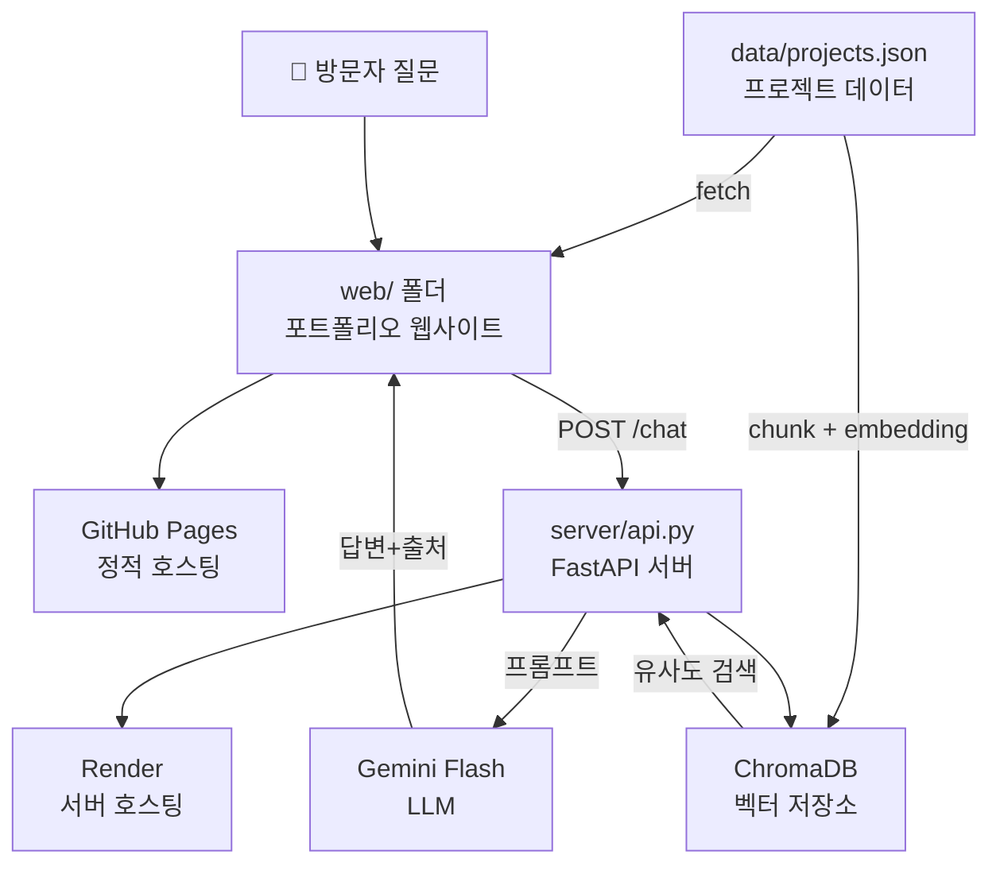

# 아키텍처 명세서

AI Portfolio RAG Chatbot 전체 시스템 구조

---

## 🎯 시스템 개요

학생 각자가 자신의 프로젝트를 검색 가능한 데이터로 문서화하고,
개성 있는 콘셉트의 포트폴리오 웹앱을 만든 뒤,
**나에 대해 질문하면 출처와 함께 답하는 RAG 챗봇**을 얹어 배포합니다.

---

## 📊 전체 아키텍처 다이어그램



---

## 🗂️ 디렉토리 구조

```
ai-portfolio-template/
├── data/
│   └── projects.json           # 📝 Single Source of Truth
│
├── web/                         # 🌐 프론트엔드
│   ├── index.html              # HTML 구조
│   ├── app.js                  # projects.json 렌더링
│   ├── style.css               # 스타일
│   └── widget.js               # 챗봇 위젯 (옵션)
│
├── server/                      # 🤖 백엔드
│   ├── rag_core.py             # RAG 엔진 (검색 + 생성)
│   ├── rag_app.py              # 로컬 테스트 UI
│   ├── prompts.py              # 시스템 프롬프트
│   └── api.py                  # FastAPI API 서버
│
├── examples/                    # 📚 참고 예시
│   ├── web1/                   # 심플 버전
│   └── web2/                   # 풀 기능 버전
│
└── docs/                        # 📖 문서
    ├── 00-OVERVIEW.md
    ├── 01-DATA.md
    ├── 02-WEBAPP.md
    ├── 03-RAG.md
    └── 04-DEPLOY.md
```

---

## 🔄 데이터 흐름

### Single Source of Truth: `data/projects.json`

```
data/projects.json
    ├─→ web/app.js (프로젝트 카드 렌더링)
    └─→ server/rag_core.py (RAG 검색)
```

**장점:**
- 데이터 일관성 보장
- 수정 시 한 곳만 변경
- 웹사이트와 챗봇이 동기화

---

## 🛠️ 기술 스택

| 계층 | 기술 | 용도 | 비용 |
|------|------|------|------|
| **데이터** | JSON | 구조화된 프로젝트 정보 | 무료 |
| **프론트엔드** | HTML/CSS/JS | 포트폴리오 웹사이트 | 무료 |
| | GitHub Pages | 정적 사이트 호스팅 | 무료 |
| **백엔드** | Python 3.9+ | 서버 언어 | 무료 |
| | FastAPI | API 프레임워크 | 무료 |
| | LangChain | RAG 파이프라인 | 무료 |
| | ChromaDB | 벡터 DB | 무료 |
| | Gemini Flash | LLM | 무료 (15 RPM) |
| | Render | 서버 호스팅 | 무료 (750시간/월) |

**💰 총 비용: 0원**

---

## 📡 API 명세

### Endpoint: POST /chat

**요청:**
```json
{
  "question": "어떤 프로젝트를 했나요?"
}
```

**응답:**
```json
{
  "answer": "저는 2개의 주요 프로젝트를 진행했습니다...",
  "sources": [
    {
      "title": "Interlocutor Adaptation Dialogue System",
      "id": "interlocutor-adaptation"
    }
  ]
}
```

---

## 🔐 보안 및 환경 변수

### 환경 변수 (.env)

```bash
GEMINI_API_KEY=your_api_key_here
```

**주의사항:**
- ❌ 코드에 API 키 하드코딩 금지
- ❌ `.env` 파일을 Git에 커밋 금지
- ✅ `.env.example`만 저장소에 포함
- ✅ Render에서는 환경 변수로 설정

---

## 🎯 학생 설계 영역

### 학생이 결정할 사항

| 영역 | 설계 항목 | 예시 |
|------|----------|------|
| **데이터** | 포함할 프로젝트 수 | 2~10개 |
| | 필수 필드 추가 | date, role, tech_stack |
| | 태그 체계 | 기술/분야/역할 태그 |
| **웹사이트** | 디자인 콘셉트 | 미니멀, 다크테크, 컬러풀 |
| | 카드 레이아웃 | 그리드, 세로, 타임라인 |
| | 필터링 기능 | 태그 필터, 검색창 |
| **RAG** | top_k 값 | 1, 2, 3, 5 |
| | 프롬프트 톤 | 친근함, 전문적 |
| | 청크 크기 | 500, 1000, 2000 |

---

## 📋 고정 레일 (변경 불가)

| 항목 | 고정 사항 |
|------|----------|
| 데이터 위치 | `data/projects.json` |
| 필수 필드 | `id`, `title`, `description`, `tags`, `link` |
| 프론트 기술 | Vanilla HTML/CSS/JavaScript |
| 백엔드 프레임워크 | FastAPI |
| 벡터 DB | ChromaDB |
| LLM | Gemini Flash |
| 배포 | GitHub Pages + Render |

---

## 🚀 배포 아키텍처

```
GitHub Repository (main branch)
    ├─→ GitHub Pages: web/ 폴더 배포
    └─→ Render: server/ 폴더 배포

GitHub Actions (CI/CD)
    ├─→ Push 시 자동 배포
    └─→ 환경 변수 자동 주입
```

---

## 📊 성능 고려사항

### 프론트엔드
- 프로젝트 10개 이하: 한 번에 로드
- 프로젝트 많을 때: 페이지네이션 고려

### 백엔드
- 첫 요청: 3~5초 (모델 로딩)
- 이후 요청: 1~2초 (RAG 검색 + 생성)
- Render 무료 티어: 15분 비활성 시 슬립

### RAG 성능
- 임베딩 모델: ~100MB (최초 1회 다운로드)
- ChromaDB: 프로젝트당 ~1KB
- 검색 속도: 밀리초 단위

---

## 🔍 확장 가능성 (선택)

### 추가 기능 아이디어
- [ ] 다국어 지원 (한/영)
- [ ] 다크 모드
- [ ] 프로젝트 상세 모달
- [ ] 방명록 기능
- [ ] 조회수 통계
- [ ] 프로젝트 검색 자동완성

---

## 📚 참고 문서

- [SPEC-BACKEND.md](SPEC-BACKEND.md) - 백엔드 API 상세 명세
- [00-OVERVIEW.md](00-OVERVIEW.md) - 전체 개요
- [REFERENCES.md](REFERENCES.md) - 외부 참고 자료
