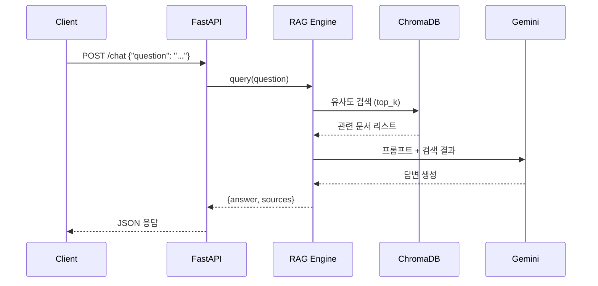

# 백엔드 API 명세서

FastAPI + RAG 챗봇 API 상세 명세

---

## 🎯 API 개요

포트폴리오 웹사이트의 챗봇에서 사용할 질의응답 API를 제공합니다.

**핵심 기능:**
- 프로젝트 데이터 기반 질의응답 (RAG)
- 출처(sources) 함께 반환
- 근거 없는 질문에는 "모른다"고 답변

---

## 📡 API Endpoints

### 1. Health Check

```http
GET /health
```

**응답:**
```json
{
  "status": "healthy",
  "rag_engine": "ready"
}
```

---

### 2. Chat (질의응답)

```http
POST /chat
Content-Type: application/json
```

**요청 Body:**
```json
{
  "question": "어떤 프로젝트를 했나요?"
}
```

**성공 응답 (200):**
```json
{
  "answer": "저는 대화 시스템과 페르소나 관련 2개의 프로젝트를 진행했습니다. 첫 번째는 Incrementally Revealed Persona 환경에서 대화 상대방의 변화에 동적으로 적응하는 대화 생성 프레임워크를 연구했으며, 두 번째는 대화 문맥에 따라 페르소나의 활성화 필요성을 실시간으로 평가하고 스케줄링하는 모듈형 아키텍처를 개발했습니다.",
  "sources": [
    {
      "id": "interlocutor-adaptation",
      "title": "Interlocutor Adaptation Dialogue System"
    },
    {
      "id": "persona-scheduling",
      "title": "Dynamic Persona Scheduling Framework"
    }
  ]
}
```

**오류 응답 (400):**
```json
{
  "detail": "Question is required"
}
```

---

## 🔄 RAG 처리 흐름



---

## 🛠️ 구현 상세

### 파일 구조

```
server/
├── api.py          # FastAPI 앱 (이 명세 구현)
├── rag_core.py     # RAG 엔진 로직
├── prompts.py      # 시스템 프롬프트
└── rag_app.py      # 로컬 테스트용
```

### 핵심 로직 (api.py)

```python
from fastapi import FastAPI
from fastapi.middleware.cors import CORSMiddleware
from pydantic import BaseModel
from rag_core import build_rag_engine

app = FastAPI()

# CORS 설정 (프론트엔드 연동)
app.add_middleware(
    CORSMiddleware,
    allow_origins=["*"],  # 프로덕션에서는 특정 도메인만 허용
    allow_methods=["*"],
    allow_headers=["*"],
)

# RAG 엔진 초기화
rag_engine = build_rag_engine()

class ChatRequest(BaseModel):
    question: str

@app.post("/chat")
def chat(request: ChatRequest):
    result = rag_engine.query(request.question)
    return {
        "answer": result["answer"],
        "sources": result["sources"]
    }
```

---

## 🔐 CORS 설정

### 로컬 개발

```python
allow_origins=["http://localhost:8080"]
```

### 배포 환경

```python
allow_origins=[
    "https://YOUR_USERNAME.github.io",
    "https://yourdomain.com"
]
```

---

## ⚙️ 환경 변수

### 필수 환경 변수

| 변수명 | 설명 | 예시 |
|--------|------|------|
| `GEMINI_API_KEY` | Gemini API 키 | `AIzaSy...` |

### 로컬 설정 (.env)

```bash
GEMINI_API_KEY=your_key_here
```

### Render 배포 설정

Render Dashboard → Environment → Add Environment Variable

---

## 📊 RAG 파라미터

### 검색 파라미터 (rag_core.py)

```python
def build_rag_engine(
    top_k=2,            # 검색할 문서 개수
    chunk_size=1000,    # 문서 청크 크기
    chunk_overlap=0,    # 청크 겹침
    rebuild=False       # 벡터 DB 재구축 여부
):
    ...
```

**튜닝 가이드:**
- `top_k`: 프로젝트 개수에 따라 조정 (2~5 권장)
- `chunk_size`: 설명이 긴 경우 증가 (500~2000)
- `chunk_overlap`: 문맥 유지 필요 시 설정 (0~200)

---

## 🎯 프롬프트 구조 (prompts.py)

```python
BASELINE_SYSTEM_PROMPT = """
당신은 AI 포트폴리오 질의응답 전문가입니다.

[지침]
1. 제공된 프로젝트 문서만을 근거로 답변하세요.
2. 문서에 없는 내용은 추측하지 마세요.
3. 답변 후 사용한 프로젝트를 출처로 명시하세요.

[답변 형식]
- 간결하고 명확하게
- 기술 용어는 정확히
- 2-3문장으로 요약
"""
```

---

## 🧪 테스트 시나리오

### 1. 프로젝트 질문 (정상)

**요청:**
```json
{"question": "NLP 프로젝트는 무엇인가요?"}
```

**기대 응답:**
- answer: NLP 태그 프로젝트 설명
- sources: 해당 프로젝트 포함

### 2. 모르는 질문 (정상)

**요청:**
```json
{"question": "이 프로젝트는 언제 했나요?"}
```

**기대 응답:**
- answer: "문서에서 날짜 정보를 확인할 수 없습니다"
- sources: 빈 배열 또는 관련 프로젝트

### 3. 빈 질문 (오류)

**요청:**
```json
{"question": ""}
```

**기대 응답:**
- 400 Bad Request

---

## 🚀 로컬 실행

### 개발 서버

```bash
# 가상환경 활성화
source .venv/bin/activate

# FastAPI 실행
uvicorn server.api:app --reload --port 8000
```

### API 문서 확인

브라우저에서:
- http://localhost:8000/docs (Swagger UI)
- http://localhost:8000/redoc (ReDoc)

### cURL 테스트

```bash
# Health Check
curl http://localhost:8000/health

# Chat
curl -X POST http://localhost:8000/chat \
  -H "Content-Type: application/json" \
  -d '{"question": "어떤 프로젝트를 했나요?"}'
```

---

## 📦 배포 명세

### Render 설정 (render.yaml)

```yaml
services:
  - type: web
    name: ai-portfolio-api
    runtime: python
    buildCommand: pip install -r requirements.txt
    startCommand: uvicorn server.api:app --host 0.0.0.0 --port $PORT
    envVars:
      - key: GEMINI_API_KEY
        sync: false  # Render 대시보드에서 직접 설정
```

### 배포 URL

```
https://your-app-name.onrender.com
```

---

## 🐛 문제 해결

### API가 응답하지 않음

1. 서버 로그 확인:
   ```bash
   # Render Dashboard → Logs
   ```

2. Health Check 확인:
   ```bash
   curl https://your-app.onrender.com/health
   ```

### CORS 에러

브라우저 콘솔에 `Access to fetch ... has been blocked by CORS` 표시

**해결:**
```python
# api.py에서 allow_origins에 프론트 URL 추가
allow_origins=["https://YOUR_USERNAME.github.io"]
```

### ChromaDB 초기화 실패

**증상:** "ChromaDB collection not found"

**해결:**
```python
# rag_core.py에서
rag_engine = build_rag_engine(rebuild=True)
```

---

## 📚 참고 문서

- [FastAPI 공식 문서](https://fastapi.tiangolo.com/)
- [LangChain RAG Tutorial](https://python.langchain.com/docs/tutorials/rag/)
- [Render Deployment Guide](https://render.com/docs/deploy-fastapi)
